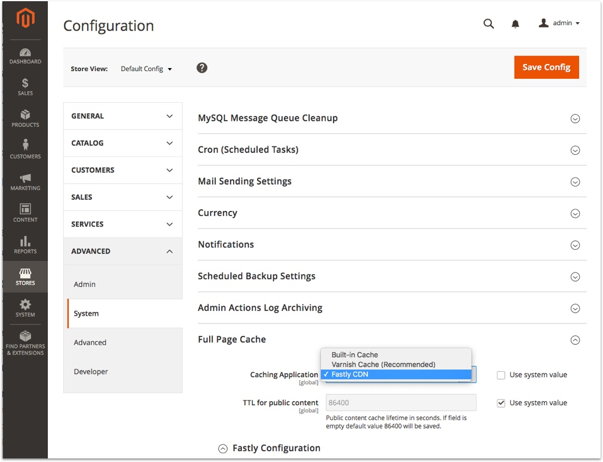

# Configuring the Fastly_Cdn Module

This document describes how to configure the Fastly_Cdn module and connect it
to Fastly's CDN services.

## Contents

* [Prerequisites](#prerequisites)
* [Configure the Fastly Service](#configure-the-fastly-service)
* [Basic Configuration](#configure-the-module)
* [Further Configuration Options](#further-configuration-options)

## Prerequisites

To proceed with configuration you will need to have
[signed up for Fastly's service](https://www.fastly.com/signup). You will need
the API token (https://manage.fastly.com/account/personal/tokens). Details of how to find these
are kept in [Fastly's documentation](https://docs.fastly.com/guides/account-management-and-security/finding-and-managing-your-account-info).

## Configure the Fastly Service

To start configuring the Fastly service for use with Magento ensure that you
have [signed up](https://www.fastly.com/signup) for the service. Once you have
confirmed the account and logged in the Fastly application will take you to a
wizard to configure your first service. This is further documented on [Fastly's documentation](https://docs.fastly.com/guides/basic-setup/sign-up-and-create-your-first-service).

## Configure the Module

This section will describe how to input the API token and service ID into the
Fastly_Cdn module. It assumes that the module has already been installed
without error. If not please see [installing the module](INSTALLATION.md) for
details of how to do this.

To enter the credentials for the Fastly_Cdn module, open a browser and log in
to the admin section of the Magento server. Navigate to:

```
Stores > Configuration > Advanced > System
```



Expand the 'Full Page Cache' section then choose 'Fastly CDN' in the 'Caching
Application' dropdown.

Adjust the TTL for public content to suit the needs of the server. (This value
is in seconds.)

Expand the 'Fastly Configuration' section to enter the remaining necessary
details.

In the 'Fastly Service ID' enter the service ID that was configured when
signing up for Fastly's services [above](#configure-the-fastly-service) and
in 'Fastly API token' enter the token. Test your API Token and Service ID pair using the button. If your credentials are valid, you may then automatically upload the Magento VCL to your Fastly service and should activate the version. Make sure to click 'Save Config' at the top of the page and then clear the Magento cache for the changes to take effect.

This is enough to start testing Fastly, but proceed to
[further configuration](#further-configuration-options) to change other
settings.

## Further Configuration Options

### Stale content delivery time

Fastly can serve stale content even if the TTL has expired. During the time it
takes Fastly to fetch the fresh content from Magento it can serve stale content
from its cache. This setting defines the time in seconds to allow Fastly to
serve stale content after the "normal" TTL has expired.

### Stale content delivery time in case of backend error

This setting defines the time in seconds that stale content can be delivered in
case the backend is down or cannot respond properly.

### Purge category

When enabled, this configures the module to listen for events which clear
generated content for a 'category' and ties a cache purge to Fastly with
these. Once cleared new content can be fetched and cached thus updating the
content.

### Purge product

When enabled, this configures the module to listen for events which clear
generated content for a 'product' and ties a cache purge to Fastly with these.
Once cleared new content can be fetched and cached thus updating the content.

Additionally, if the "Purge Category" option is set to "Yes" this also
triggers the product's categories to be purged on product/product stock
update. This option is useful to keep product pages and categories up-to-date
when a product becomes out of stock (i.e. when the last item purchased by a
customer).

### Purge CMS page

This option binds automatic purge of CMS page (Fastly) cache with its update
event. If set to "Yes" CMS page cache is invalidated each time CMS page update
event occurs (i.e. CMS page content update via Magento admin).

### Use Soft Purge

Using soft purge will not remove the content immediately from Fastly's cache
but mark it as stale. In combination with the stale timings your customers will
be served stale content very fast while Fastly is updating the content in the
background.

### GeoIP handling

GeoIP handling will get the country of a web client based on its IP address.
This feature can be used to either automatically redirect visitors to the
store matching their country or to show them a dialog to select the desired
store themselves.

#### Configuration

In your Magento2 backend go to Stores -> Configuration -> System in the
"Advanced" section and open "Full Page Cache" tab and choose "Yes" with "Enable
GeoIP". Make sure to be on store configuration scope.

#### General behavior

The Fastly module supports two options to serve the store view based on GeoIP
country code: It can show the visitor a modal dialog to give him the option to
switch to a frontend that fits to his country or he can be redirected
automatically. Both actions are performed using JavaScript and can be adjusted
if necessary.

In the VCL the cookie headers are examined. If either the `X-Magento-Vary` or
`form_key` cookie are present this Fastly will not take any action as it
presumes the customer either saw (and maybe interacted with) the modal dialog
or was automatically redirected to the matching store. If the form_key cookies
is present the visitor has been browsing around so he shouldn't be disturbed by
dialogs or redirects.

##### GeoIP Action

Choose "Dialog" to show a modal dialog to the visitor. This gives him the
option to switch to the suggested store based in the GeoIP lookup and the
"GeoIP Country Mapping" (see below) or stay on the current frontend. Choose
"Redirect" to perform redirect the visitor to an appropriate store view.

##### GeoIP Country Mapping

For every country you want to map to a specific store you have to enter a
country code and select a target store. All country codes use ISO
3166-1-alpha-2 codes. You can use "*" as wildcard to match all country codes.

##### Prevent redirect or static blocks to be shown

You probably don't want to redirect your customers to another store if the
country of your visitor matches the current store. To prevent redirects you
have to add a mapping using the country code of that store and leave the other
field empty. This way, if your customer is in the "right" store (based on the
country), no GeoIP based action will be triggered.

## Next Steps

For production ecommerce sites TLS (SSL) is most certainly needed. The options
for deploying this are documented in [TLS configuration](TLS.md).
