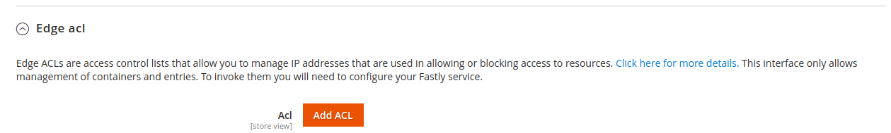
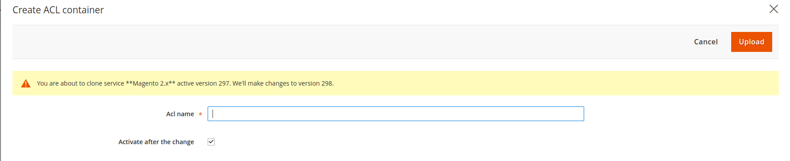
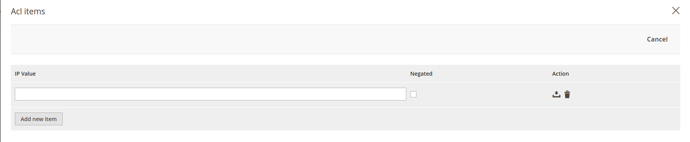

# ACL (Access Control Lists)

This guide will show how to add a Fastly ACL to your Fastly configuration. You can find more
details on what ACLs are [here https://docs.fastly.com/guides/access-control-lists/about-edge-acls]

To add an ACL, go to:
```
Magento admin > Stores > Configuration > Advanced > System > Full Page Cache > Fastly Configuration
```
Under *Edge acl* tab, new ACL can be created by clicking **Add ACL** button



A popup will appear in which name of ACL must be entered, and if you want
ACL active from new version, a checkbox for activation must be ticked.



After adding ACL container we can add new items that will belong to this ACL. 
To add new items we click on gear right of newly created entry under *Edge acl* tab which will trigger a popup.



Under **IP Value** enter the IP you want to handle. It is also possible to enter IPs in CIDR format, example: 192.168.1.0/24.
Negate option allows you to exclude certain IP or prefix from matching an ACL. Negation is achieved by adding *!* before the IP or CIDR address.
For example you can add an ACL for 192.168.1.0/24 but negate *!192.168.1.5* which if ACL is applied for blocking access will block access to all IPs in
192.168.1.0/24 except for *192.168.1.5*. In general you are unlikely to need negation.

Click **Save** button to the right of the newly created entry to save, or click **Delete** button to remove an entry.
