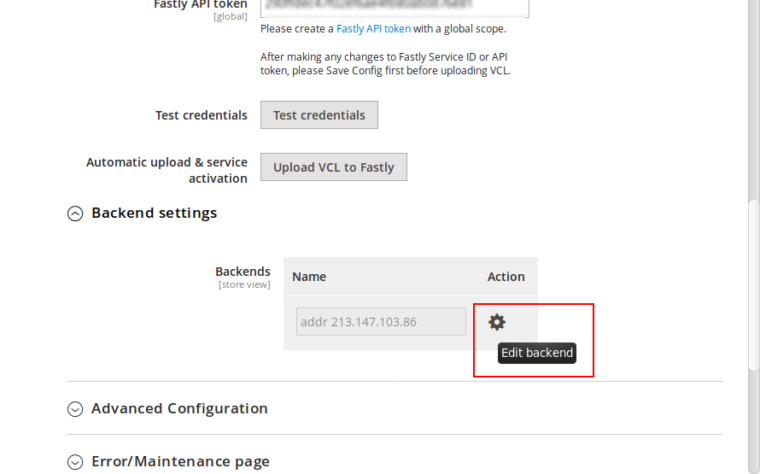
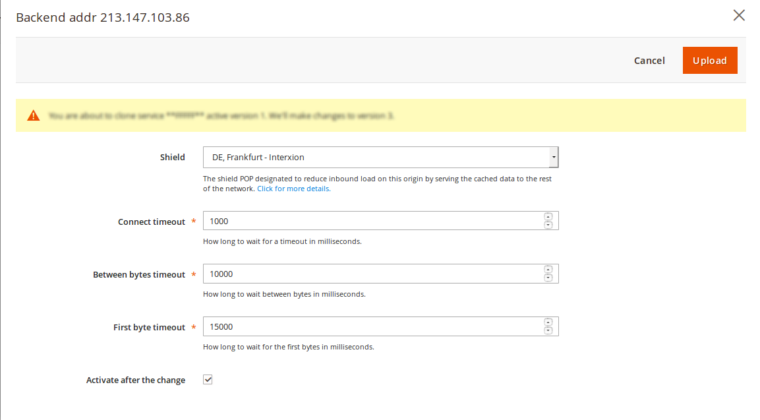

# Backend settings guide

This guide will show you how to how to fine tune Fastly’s service performance by configuring Origin shielding and timeout settings.

### Origin shielding

Origin shielding is Fastly’s service feature which reduces the load on your origin server by routing all requests to a specfic **Point of Presence** (POP) which you have designated as a shield node to your origin.

#### How shielding works

With shielding enabled, when the first request for content arrives at one of the POP’s, for e.g. **POP A**, POP A doesn’t have that content cached. The request is passed to the **Shield POP** which also doesn’t have the content cached and passes request to the customers **Origin server** to fetch the content and store it in cache. The cached content is then passed to the POP A and served to the user.

Now, when another request arrives at **POP B** instead of POP A, POP B will pass request to the Shield POP, and since the Shield POP already has a cached copy from the first request, no future requests for the content would be passed along to the customer’s origin server until the shield POP’s cached copy of it expires.

### Backend timeouts

A backend is an address (IP or domain) from which Fastly pulls content. Backend timeouts define how long will Fastly wait for backend operations to complete.

You can set three different timeouts:

* Connect timeout – how long to wait for a timeout in milliseconds. (default: 1000ms)
* First byte timeout – limits how long the processing time of the backend may be. (default: 10000ms)
* Between bytes timeout – limits how long we will wait between for two subsequent successful reads on the backend connection. (default: 15000ms)


### Fastly configuration

You can configure Origin shielding and Backend timeout in the Fastly module by going to:

```
Magento admin > Stores > Configuration > Advanced > System > Full Page Cache > Fastly Configuration
```

Under the Fastly Configuration, click on the **Backend settings:**



There you will see a list of backends. Click on the cog icon next to the backend for which you want to configure **Shielding.**

The modal window will pop up with the following content:



For the Shield value you should select a Fastly POP/datacenter that is close to your backend. UI has few suggestions based on your cloud provider's region. As for backend timeout settings, it’s best to leave default values or set them according to your needs. If you are getting a lot of `first byte timeout` errors you can increase the timeout higher. Press the Upload button in the upper right corner to apply your changes.

That’s it, you have successfully fine tuned your Fastly service.
