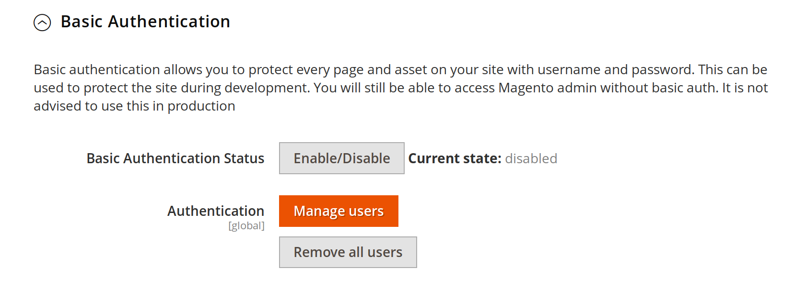
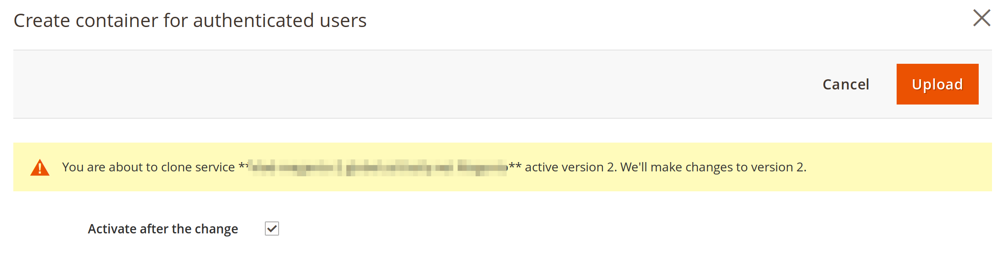
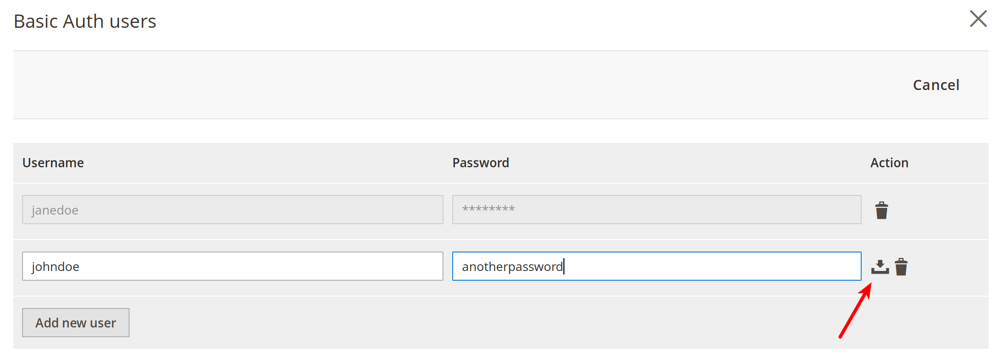
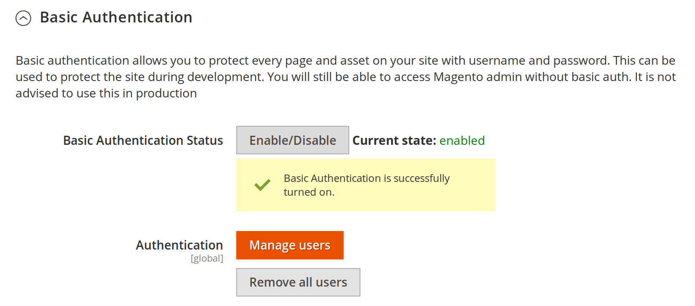

# Basic Authentication guide

This guide will show how to setup Basic Authentication for your site. Basic auth is useful when you are
in the process of implementing your store and want to prevent public access e.g. disallow crawlers, curious
users from seeing your site. 

All parts of the site will be secured except the Admin site (this is to prevent accidental lockouts).

To enable Basic Authentication, go to:

```
Magento admin > Stores > Configuration > Advanced > System > Full Page Cache > Fastly Configuration
```

Under the *Basic Authentication** tab, you will see a screen like this. 



First thing you will need to do is add user/password pairs for basic auth. To do so click on **Manage Users** button. 
A modal window with the following content will pop up.



press the **Upload button** in the upper right corner. This will create a Fastly Edge Dictionary that is used to store
authentication information. Once done, another modal window will open up that allows you to add username/password pairs for users. 
After adding an entry make sure you click on the save icon (pointed out with a red arrow).



Once the basic auth users have been created click on the **Enable/Disable** button. A modal window will show up. Press the 
**Upload button** in the upper right corner to activate it. 

The modal windows will close and you will see a success message. Also, the current state will change to **enabled**.




## Turning off Basic Auth

Once you are ready to go live you will want to turn off Basic Auth. This can be achieved by clicking the **Enable/Disable** button then clicking the **Upload button**. Please note this will not remove basic auth users table so you may see a warning in Fastly UI about _magentomodule_basic_auth_ table not being used. This is not a critical error and you can disregard it. If you are sure you no longer need Basic Auth you can follow **Removing all users** instructions below. 

## Removing all users

If you need to start from scratch or want to completely remove all remanants of Basic Auth click the **Remove all users** button. Please note this will disable Basic Authentication since with no users Basic Auth is pointless.
