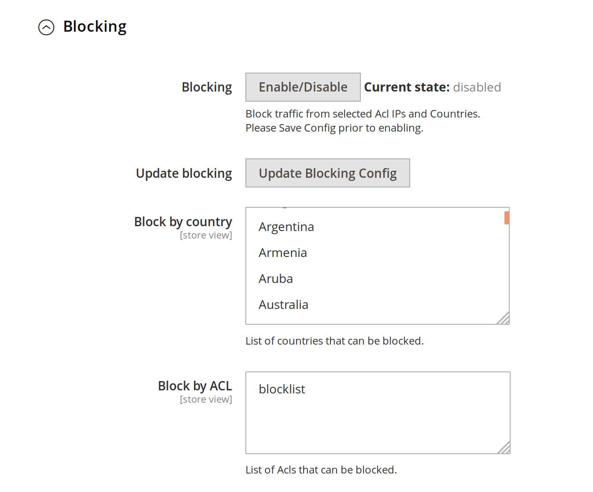

# Blocking

This guide will show how to setup blocking. This particular function supports blocking by

* List of countries
* List of [Access Control Lists - ACLs](https://github.com/fastly/fastly-magento2/blob/master/Documentation/Guides/ACL.md)

This is useful in the cases where you want to block access for users coming from specific countries
or certain IPs or IP ranges.

To enable Blocking, go to:

```
Magento admin > Stores > Configuration > Advanced > System > Full Page Cache > Fastly Configuration
```

Under the *Blocking* tab, you will see a screen like this.



## Configuring Blocking

You can select to block by list of countries and/or ACLs. Multiple selections are possible if you hold the Control key
when selecting a list of countries. If you don't see any [ACL](https://github.com/fastly/fastly-magento2/blob/master/Documentation/Guides/ACL.md) listed in the selection box you will need to create one.

## Enable Blocking

To enable Blocking click the **Enable/Disable** button and follow the directions.

## Changing blocking config

After any change to the blocking rules you need to click the *Update Blocking Config* button.

## Turning off Blocking

Once you are ready to go live you will want to turn off Blocking. This can be achieved by clicking the **Enable/Disable** button then clicking the **Upload button**.
