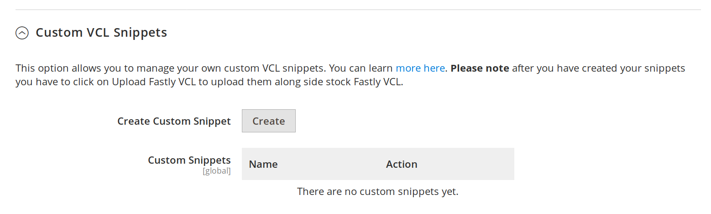
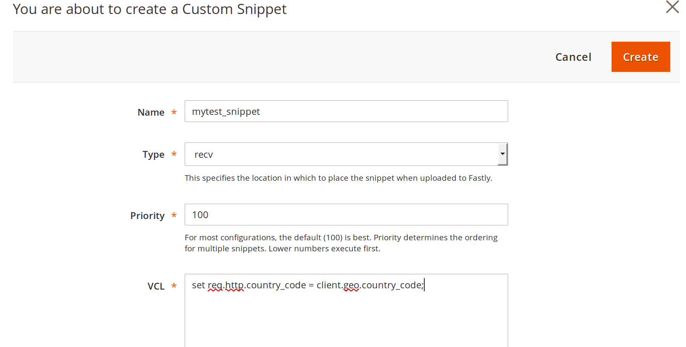
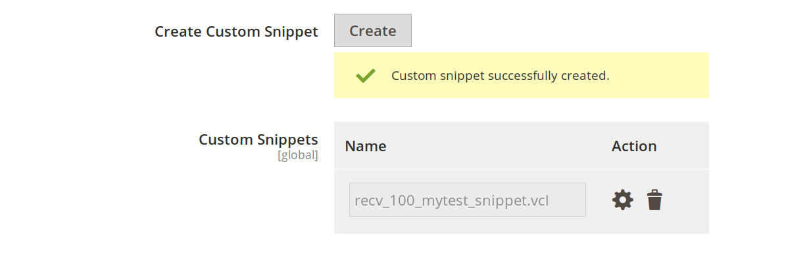

Custom VCL snippets
===================

This feature is available in version 1.2.58+

There are two ways of providing custom VCL snippets

* Manual - using Magento Admin UI by clicking Create in the UI and supplying the required inputs
* Automated - deposit snippets that follow a naming convention in a special directory

# Manual

VCL Snippet UI can be found

```
Magento admin > Stores > Configuration > Advanced > System > Full Page Cache > Fastly Configuration > Custom VCL Snippets
```

Once you expand the menu you will be greeted with a menu like this



In this menu you can either create new snippets or edit/remove existing ones.

### Limitation

**IMPORTANT!** The Custom VCL snippets UI shows only the snippets added through the Magento Admin UI. You must use the Fastly UI/API to manage custom snippets added from outside of the Magento Admin UI.

## Creating snippets in the UI

To create a snippet click Create. A dialog like this will show up



Fill out as appropriate

* *Name*: alphanumeric short description. Use underscores (_) instead of dashes (-)
* *Type*: is the type of snippet e.g. recv, fetch, miss, pass, init etc.
* *Priority*: defines the order of insertion of the snippet in the code. Lower number
  is higher priority. Default Fastly VCL inserted by Magento module carries priority of 50
* *VCL*: defines the actual VCL code to be uploaded

After snippet has been created you will see a screen like this



*Please note*: After creating snippets or editing them you need to click the `Upload VCL` button at the top of Fastly configuration to upload
VCL snippets to Fastly. They will be uploaded together with the latest version of the stock Magento snippets

## Editing/deleting snippets in the UI

You can edit existing snippets in the UI. After any change you need to click the `Upload VCL` button to upload them to Fastly.

# Automated custom VCL snippets deployment

Please add any
[VCL snippets](https://docs.fastly.com/en/guides/using-regular-vcl-snippets) 
to `$MAGENTO_HOME/var/vcl_snippets_custom`
that should be uploaded any time you click upload custom VCL in the Magento admin.

Snippets need to follow this naming convention

```
<vcl_snippet_type>_<priority>_<short_name_description>.vcl
```

* *vcl_snippet_type* is the type of snippet e.g. recv, fetch, miss, pass, init etc.
* *priority* defines the order of insertion of the snippet in the code. Lower number
  is higher priority. Default Fastly VCL inserted by Magento module carries priority of 50
* alphanumeric short description. Use underscores (_) instead of dashes (-)

For example

```
recv_10_block_except_allowlist.vcl
```

Will create a VCL snippet of type *recv*, priority *10* named *magentomodule_custom_block_except_allowlist*.
Magentomodule will be prepended to any snippet uploaded by the Magento admin.

Please note any time you reupload VCL from the Magento admin it will overwrite any changes.


