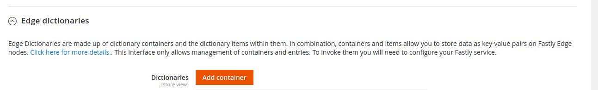
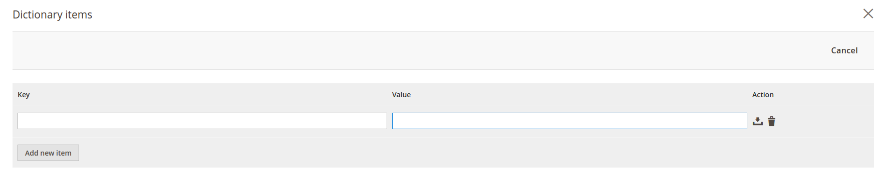

# Dictionaries

This guide will show how to add Fastly Dictionaries to your site. 

To add dictionary, go to:
```
Magento admin > Stores > Configuration > Advanced > System > Full Page Cache > Fastly Configuration
```
Under *Edge dictionaries* tab, new dictionary can be created by clicking **Add container** button



After adding new dictionary container, a popup will appear in which name of dictionary must be entered, and if you want
dictionary active from new version, a checkbox for activation must be ticked.


After adding dictionary container we can add new items that will belong to this dictionary. 
To add new items we click on gear left of newly created entry under *Edge dictionaries* tab which will trigger a popup.



Once you enter **Key** and **Value**, you can add dictionary item by clicking **Save** button to the right of the item.
To remove dictionary item, click **Delete** button to the right of the item.