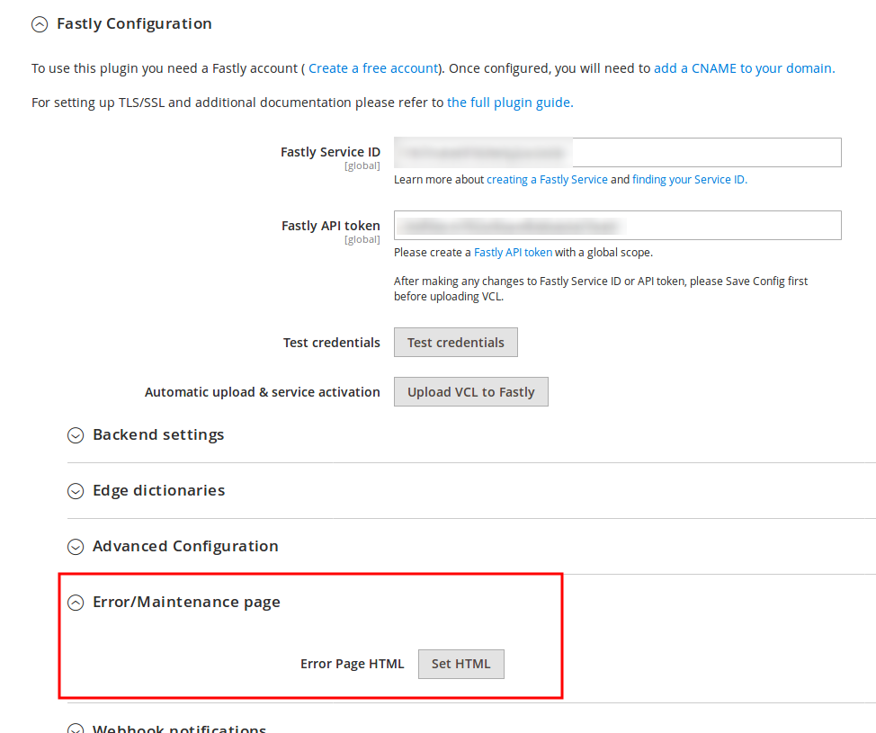
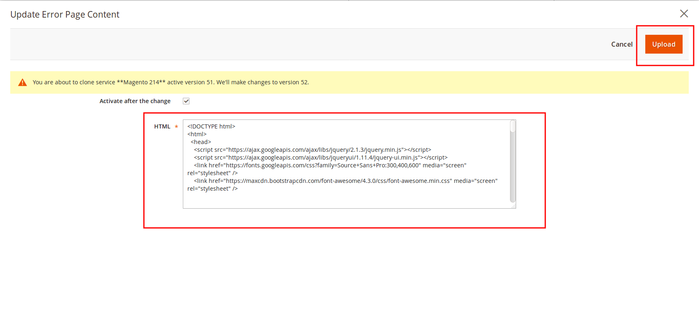
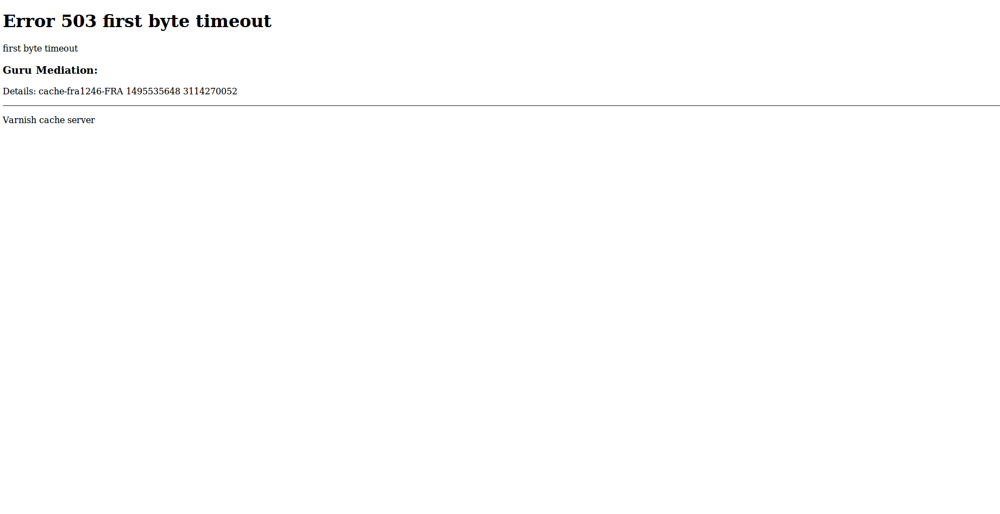
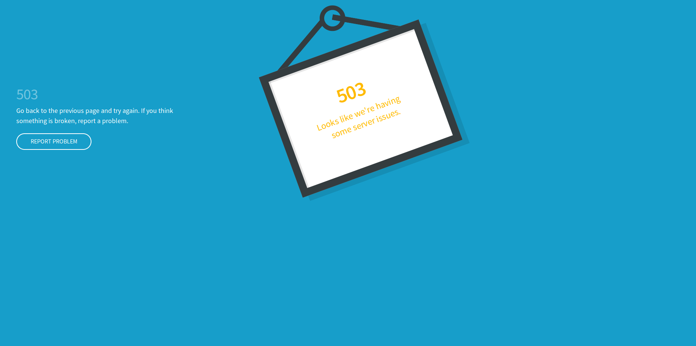

# Set Error / Maintenance page guide

The Fastly CDN will sometimes return a 503 error due to various issues that can occur. The generic text associated with a 503 error is “Service Unavailable” and it can mean variety of things. This default error response can be confusing to the customers and have a basic look and feel. 

This guide will show you how to set friendly or prettier 503 custom error page through Fastly module which will be served when:
 * When origin returns a response status greater than 500
 * When origin is down (i.e unhealthy, timeout, etc)
 
 To set custom Error page, go to:
 
```
Magento admin > Stores > Configuration > Advanced > System > Full Page Cache > Fastly Configuration
```

Under the Fastly Configuration, click on the **Error/Maintenance page:**



The modal window will pop up. Paste your custom HTML code into the HTML textarea and press the Upload button to save changes. 



Now when Fastly returns 503 error, instead of default error page which looks something like this: 



You will serve your custom error page:


