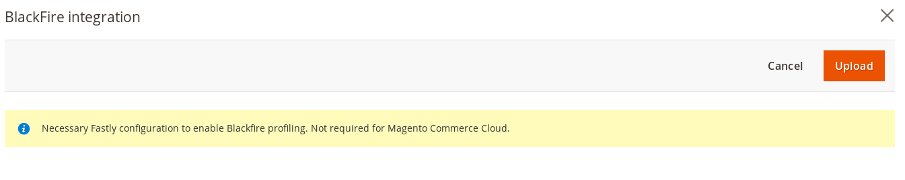

# Fastly Edge Modules - Blackfire integration 

This module will enable Blackfire integration. It's available in module version 1.2.103+. It's based on instructions
from [Blackfire reference guide on bypassing reverse proxy cache and CDNs](https://blackfire.io/docs/reference-guide/configuration#bypassing-reverse-proxy-cache-and-content-delivery-networks-cdn).

Before you can use Fastly Edge Modules you need to [make sure they are enabled](https://github.com/fastly/fastly-magento2/blob/master/Documentation/Guides/Edge-Modules/EDGE-MODULES.md) and that you have selected the Blackfire integration module.

When you click on the configuration you will be prompted with a screen like this



## Configurable options

### ACL

Pick ACL (Access Control List) that contains a list of admin IPs that are allowed to initiate profiling. If there are no ACLs listed or you want to specify a new
one [you can create it using the ACL interface](https://github.com/fastly/fastly-magento2/blob/master/Documentation/Guides/ACL.md).

## Enabling

After any change to the settings you need to click Upload as that will upload require VCL code to Fastly.

## Technical details

Following VCL will be uploaded

Snippet Type: vcl_recv

```vcl
   if (req.http.X-Blackfire-Query && req.http.Fastly-Client-IP ~ maint_allowlist) {
     if (req.esi_level > 0) {
        # ESI request should not be included in the profile.
        # Instead you should profile them separately, each one
        # in their dedicated profile.
        # Removing the Blackfire header avoids to trigger the profiling.
        # Not returning let it go through your usual workflow as a regular
        # ESI request without distinction.
        unset req.http.X-Blackfire-Query;
     } else {
        set req.http.X-Pass = "1";
     }
   }
```
