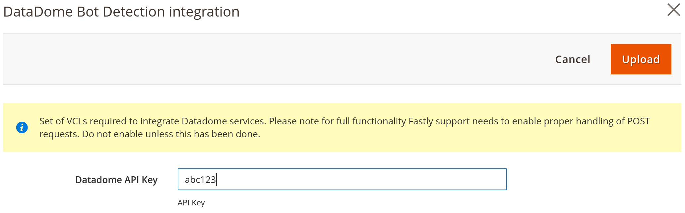

# Fastly Edge Modules - DataDome integration 

DataDome is a real-time bot protection. To enable the module, start your 30 days free trial at https://datadome.co/free-signup/.

This module enables [DataDome integration](https://docs.datadome.co/docs/magento-with-fastly-cdn "DataDome Documetation"), it provides integration between Fastly Edge module and DataDome. It is available from module version 1.2.127+. 

Before you can use Fastly Edge Modules you need to [make sure they are enabled](https://github.com/fastly/fastly-magento2/blob/master/Documentation/Guides/Edge-Modules/EDGE-MODULES.md) and that you have selected the Datadome integration module.

Once the module is enabled, the following settings screen should be configured:

## Configurable options

| Setting | Description |
|---------|-------------|
| API Key | Your DataDome License key |
| Exclusion Regex | The regex that will be applied to req.url.ext |
| Connection Timeout | How long to wait for a timeout in milliseconds. |
| First byte timeout | How long to wait for the first byte in milliseconds. |
| Between bytes tiemout | How long to wait between bytes in milliseconds. |

## Enabling

After any change to the settings you need to click *Upload* as that will upload require VCL code to Fastly.

## Full documentation 

You can access the full documentation on [DataDome's website](https://docs.datadome.co/docs/magento-with-fastly-cdn "Documentation")