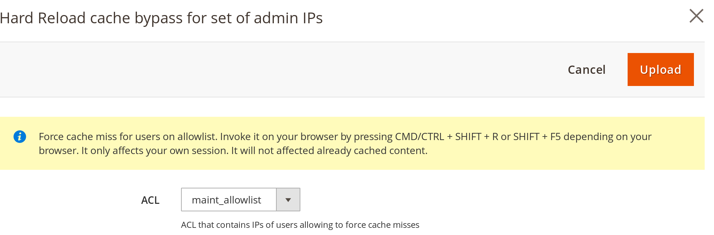

# Fastly Edge Modules - Hard Reload Cache Bypass for admins

This guide will show how to configure hard reload cache bypass for admin IPs. This feature allows  
administrators to force a cache miss in their browser by pressing CMD/CTRL + SHIFT + R or SHIFT + F5.
Administrators are defined as those users on the selected Access Control List (ACL).
[More details can be found here](https://github.com/fastly/fastly-magento2/issues/147)

Before you can use Fastly Edge Modules you need to [make sure they are enabled](https://github.com/fastly/fastly-magento2/blob/master/Documentation/Guides/Edge-Modules/EDGE-MODULES.md)

When you click on the configuration you will be prompted with a screen like this



## Configurable options

### ACL

Pick ACL (Access Control List) that contains a list of admin IPs. If there are no ACLs listed or you want to specify a new
one [you can create it using the ACL interface](https://github.com/fastly/fastly-magento2/blob/master/Documentation/Guides/ACL.md).


## Enabling

After any change to the settings you need to click Upload as that will activate the functionality you configured.

## Technical details

Following VCL snippets are being uploaded

Snippet Type: vcl_recv

```vcl
if ( req.http.Fastly-Client-IP ~ maint_allowlist && req.http.pragma ~ "no-cache" ) {
  set req.hash_always_miss = true;
}
```

Snippet Type: vcl_hash

```vcl
if ( req.http.Fastly-Client-IP ~ maint_allowlist && req.http.pragma ~ "no-cache" ) {
  set req.hash += "NOCACHE";
}
```
