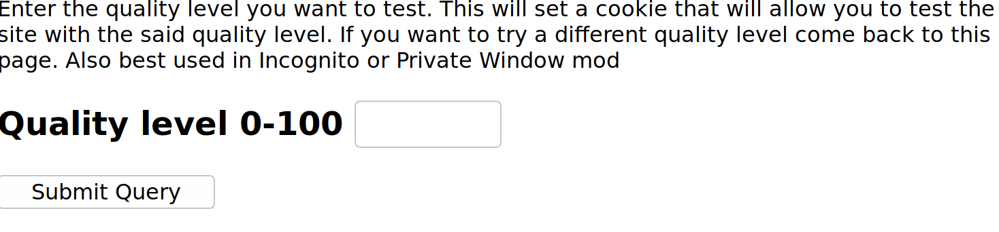
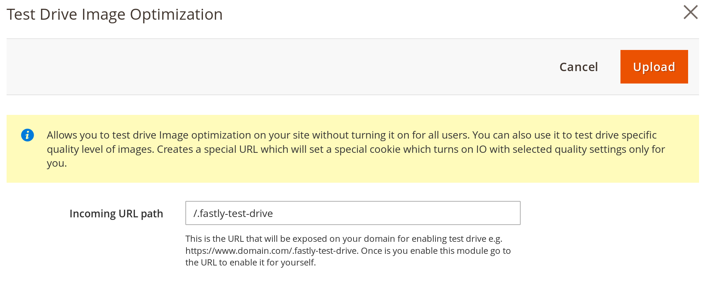

# Fastly Edge Modules - Image Optimization Test Drive

This guide will show how to configure Image Optimization Test Drive. Intention is to allow 
users to "test drive" different image qualities. As there is no "ideal" image quality and it's
a tradeoff between visual accuracy and file size this feature allows you to test see how
different image qualities affect visual accuracy on your actual site.

Once this edge module is activated it creates a special URL that allows a user to set an image
quality through an interface like this



Once a users submits a quality value their browser will be sent a special cookie which expires in 1 hour during which time they will be browsing the site with the selected image quality. No other users will
be affected.

In addition to showing the transformed image test drive will overlay the percent savings for
that specific image.


## Prerequisites

This functionality will only work if Image Optimization feature is enabled on your Fastly service. To check please go to

```
Magento admin > Stores > Configuration > Advanced > System > Full Page Cache > Fastly Configuration > Image optimization
```

and make sure you do not get a screen like this


If you do it means you do not have the IO feature enabled and need to talk to the Fastly support team.

Before you can use Fastly Edge Modules you need to [make sure they are enabled](https://github.com/fastly/fastly-magento2/blob/master/Documentation/Guides/Edge-Modules/EDGE-MODULES.md)

## Configuration

When you click on the configuration you will be prompted with a screen like this



## Configurable options

### Incoming URL path

Incoming URL path is a special/secret URL that is added to your web site in order to be able to 
turn on. If your shop name is https://shop.domain.com/ URL created will be e.g. https://shop.domain.com/.fastly-test-drive. You are configure it to anything you want. Do not set it to 
an existing URL of your shop as this URL will take priority.

## Enabling

After any change to the settings you need to click Upload as that will activate the functionality you configured.
