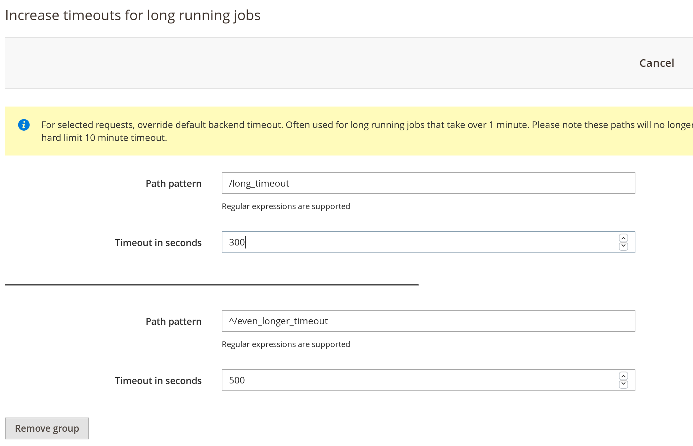

# Fastly Edge Modules - Increase timeouts for long jobs

This functionality is available in version 1.2.98 and higher.

This guide will show how to increase timeouts for certain URL paths. By default Fastly has a 1 minute
timeout for cacheable objects and 10 minute timeout for uncacheable objects. In case you are running
into timeout issues running certain type of jobs e.g. export/import jobs this module allows you to 
adjust timeouts for those specific URL paths. Please note this particular setting will make
any of the paths uncacheable.

Before you can use Fastly Edge Modules you need to [make sure they are enabled](https://github.com/fastly/fastly-magento2/blob/master/Documentation/Guides/Edge-Modules/EDGE-MODULES.md)

When you click on the configuration you will be prompted with a screen like this



You can specify multiple paths by clicking *Add Group* button

## Configurable options

### Path pattern

Path pattern with regular expressions accepted e.g. `^/somepath`

### Timeout in seconds

Timeout in seconds e.g. `500`. Please note setting timeout to more than 600 will still be limited
by Fastly's hard limit of 600 second timeouts.

## Enabling

After any change to the settings you need to click Upload as that will activate the functionality you configured.

## Technical details

Following VCL snippets are being uploaded

Snippet Type: vcl_recv
Priority: 60

```vcl
if (req.restarts == 0) {
    unset req.http.x-edge-module-timeout;
}
if (req.url ~ "^/even_longer_timeout") {
  set req.http.x-pass = "1";
  set req.http.x-edge-module-timeout = "500";
}

```

Snippet Type: vcl_pass
Priority: 60

```vcl
if (req.http.x-edge-module-timeout) {
  set bereq.first_byte_timeout = std.atof(req.http.x-edge-module-timeout);
}
```
