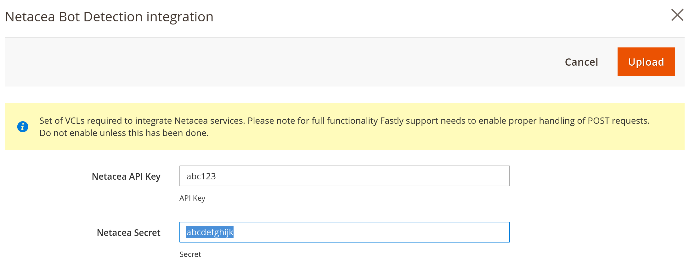

# Fastly Edge Modules - Netacea integration 

This module will enable Netacea integration. Netacea is a security provider providing services such 
as bot detection, etc. You have to have an account with Netacea before proceeding. This module only provides
integration with Netacea service. It's available in module version 1.2.131+. 

Before you can use Fastly Edge Modules you need to [make sure they are enabled](https://github.com/fastly/fastly-magento2/blob/master/Documentation/Guides/Edge-Modules/EDGE-MODULES.md) and that you have selected the Netacea integration module.

After you have enabled the module it's time to configure. You will be prompted with a screen like this

## Configurable options

### Netacea API Key

This is the API key provided to you by Netacea.

### Netacea Secret

This is the Secret provided to you by Netacea.

### Netacea Ignore List

This is the list of URL paths which integration will skip and won't apply any action to requests.  
For example, if you put path `/skipthis` in this field then integration will skip requests coming from `www.domain.com/skipthis` and other paths that has this value as a base, like `/skipthis/mysite`.

## Enabling

After any change to the settings you need to click *Upload* as that will upload require VCL code to Fastly.
