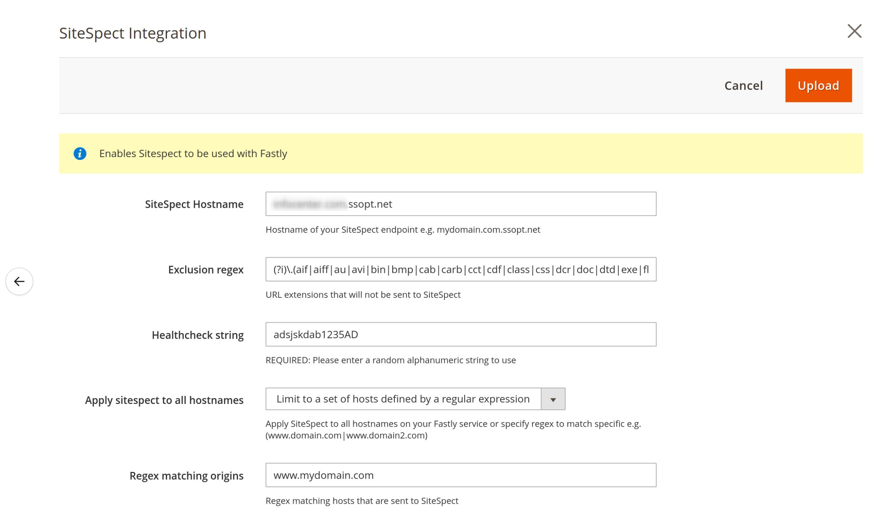

# Fastly Edge Modules - SiteSpect integration 

This module will enable SiteSpect integration. SiteSpect is an optimization platform providing services such 
as A/B testing, personalization, etc. You have to have an account with SiteSpect before proceeding. It's available in versions 1.2.168+. 

Before you can use Fastly Edge Modules you need to [make sure they are enabled](https://github.com/fastly/fastly-magento2/blob/master/Documentation/Guides/Edge-Modules/EDGE-MODULES.md) and that you have selected the Netacea integration module.

After you have enabled the module it's time to configure. You will be prompted with a screen like this

## Configurable options

### SiteSpect Hostname

This is the SiteSpect endpoint provided to you by the SiteSpect team e.g. domain.com.ssopt.net

### Exclusion regex

Provides a regular expression to match file extensions that should not be processed by SiteSpect e.g. any images such as JPG, PNG etc. Typically you will not need to modify it.

## Healthcheck string

This is a random alphanumeric string you should enter for SiteSpect healthchecks to work. Please do not add any special characters only numbers and letters.

## Apply SiteSpect to all hostnames

In multi-site setups you may opt to send only a limited set of hostnames/domains to SiteSpect. If so please choose `Limit to a set of hosts defined by regular expression` and specify a regular expression that will match such hostnames.

## Regex matching hostnames

This is an optional setting that specifies a list regular expression to match hostnames we want to send to SiteSpect. It requires you to choose `Limit to a set of hosts defined by regular expression` in the `Apply SiteSpect to all hostnames` drop down.
