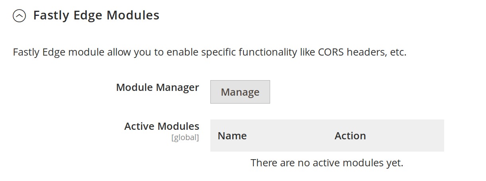
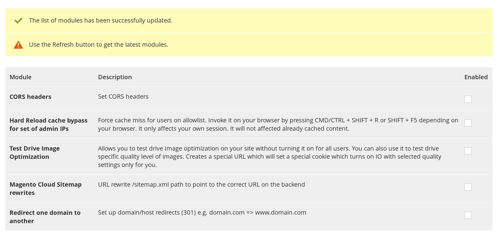
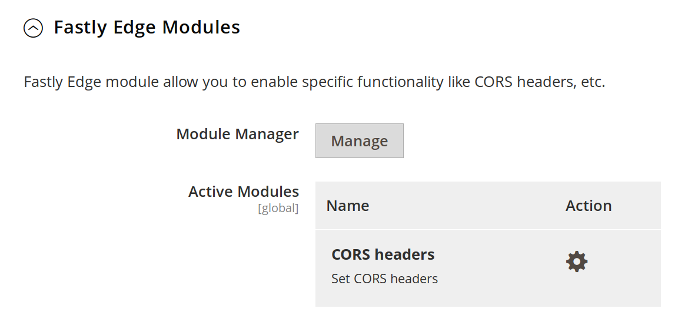

# Fastly Edge Modules

This guide will show how to configure Fastly Edge Modules. Fastly Edge Modules
is a flexible framework that allows definition of UI components and associated VCL
code through a template.

In order to enable Fastly Edge Modules you will need to turn them on by going to

```
Magento admin > Stores > Configuration > Advanced > System > Full Page Cache > Fastly Configuration > Advanced
```

Find *Enable Fastly Edge Modules* and select Yes then press Save Config at top right. After enabling you 
should now see Fastly Edge Module sub-menu like this



Click on Manage. Then Refresh button. A screen like this will be presented



You can now pick which modules you want to select. For example in this example I picked the CORS headers edge module



Now that you have selected which modules will be used you will need to go module by module and
configure them individually. Make sure you click Upload once you done configuring individual modules.

Currently following Edge Modules are bundled in

- [Blackfire integration](https://github.com/fastly/fastly-magento2/blob/master/Documentation/Guides/Edge-Modules/EDGE-MODULE-BLACKFIRE-INTEGRATION.md) - enable Fastly portion required for Blackfire profiling
- [Increase timeouts for long running jobs](https://github.com/fastly/fastly-magento2/blob/master/Documentation/Guides/Edge-Modules/EDGE-MODULE-INCREASE-TIMEOUTS-LONG-JOBS.md) - Tweak timeouts for jobs/URLs that take longer than 1 minute
- [CORS headers](https://github.com/fastly/fastly-magento2/blob/master/Documentation/Guides/Edge-Modules/EDGE-MODULE-CORS-HEADERS.md) - Set CORS headers sent to the end user
- [Magento Cloud Sitemap rewrites](https://github.com/fastly/fastly-magento2/blob/master/Documentation/Guides/Edge-Modules/EDGE-MODULE-CLOUD-SITEMAP-REWRITE.md) - rewrite incoming /sitemap.xml URL to
a filesystem URL
- [Redirect one domain to another](https://github.com/fastly/fastly-magento2/blob/master/Documentation/Guides/Edge-Modules/EDGE-MODULE-REDIRECT-DOMAIN.md) - redirect one domain to another e.g. domain.com 
to www.domain.com. Useful for redirecting apex/naked domains to www.
- [Hard Reload Cache Bypass for admins](https://github.com/fastly/fastly-magento2/blob/master/Documentation/Guides/Edge-Modules/EDGE-MODULE-HARD-RELOAD-CACHE-BYPASS.md) - allows admin IPs to force cache bypass on browser hard reload. [More details here](https://github.com/fastly/fastly-magento2/issues/147)
- [Image Optimization Test Drive](https://github.com/fastly/fastly-magento2/blob/master/Documentation/Guides/Edge-Modules/EDGE-MODULE-IMAGE-OPTIMIZATION-TEST-DRIVE.md) - view your site with a configurable image quality and see what the savings could be in real time. Helps answer the question "What image quality level should I set".
- [Integrate other CMS/backend](https://github.com/fastly/fastly-magento2/blob/master/Documentation/Guides/Edge-Modules/EDGE-MODULE-OTHER-CMS-INTEGRATION.md) - configures integration of specific URLs to integrate  other CMSes/backends into your Magento shop
