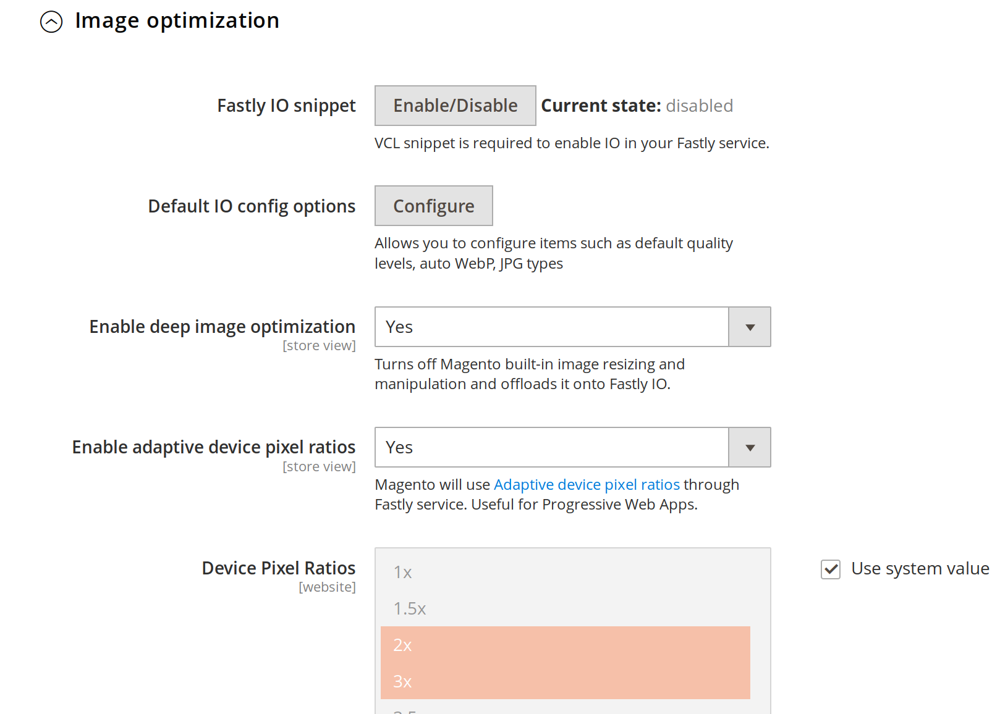
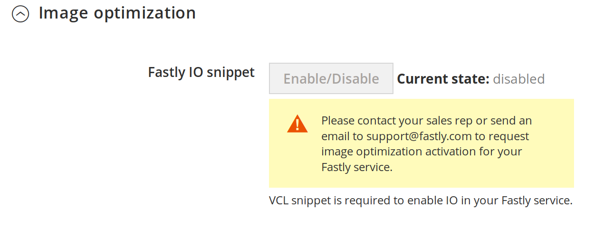
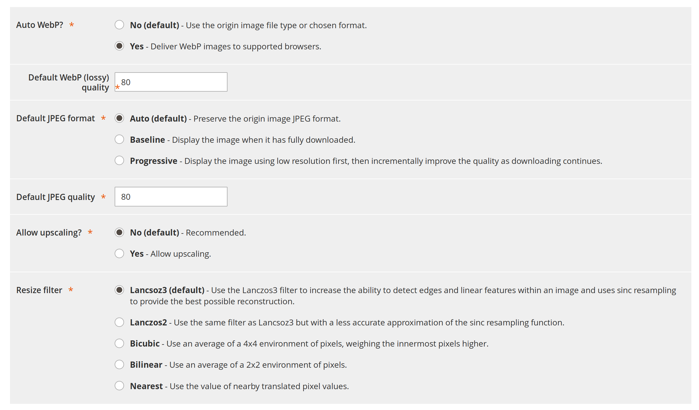

# Image Optimization (IO) Guide

This guide will show how enable Fastly Image Optimization from the Magento admin and discuss configurable options.

## Prerequisite

* You have to have IO feature enabled for your Fastly service. IO is a paid add-on.
* It's recommended you run the latest version of the Fastly module
 
## Enablement
 
Once you're ready, go to: 

```
Magento admin > Stores > Configuration > Advanced > System > Full Page Cache > Fastly Configuration
```

Click on the **Image Optimization** tab. 

You will be presented with a dialog such as this



If instead you receive this message



it means you do not have the IO feature enabled and need to talk to the Fastly support team.

There are four main categories

* Fastly IO Snippet Upload
* Default IO config options (available in 1.2.52+)
* Force lossy conversion (available in 1.2.57+)
* Deep image optimization
* Set background color on images (available in 1.2.64+)
* Set canvas on images (available in 1.2.65+)
* Adaptive pixel ratios

## Fastly IO Snippet Upload

IO Snippet Upload is required in order to enable IO on your images. It inserts a VCL snippet in your Fastly service
which instructs Fastly to process all images through our Image optimizers. This snippet will use default IO config
options to process images. Things to note

* It will not do any other transformations e.g. cropping, rotations etc.
* It will not do any image format changes except for browsers supporting WebP (Chrome etc.) it converts JPEG to WEBP
* PNG images will not see much improvement since they are lossless and it's generally hard to compress them further

For the curious clicking Enable will

* Upload [https://github.com/fastly/fastly-magento2/blob/master/etc/vcl_snippets_image_optimizations/recv.vcl](https://github.com/fastly/fastly-magento2/blob/master/etc/vcl_snippets_image_optimizations/recv.vcl) snippet
* Configure default IO config options to use WebP for browsers supporting it (auto=webp) and optionally set the JPEG and WebP image
quality levels to the value set in Magento. If the option is not set we'll default to quality 85 for lossy images.

## Default IO config options

Default IO config options allow you to tweak default settings that Image optimizers use to optimize your images



Things you may commonly change are WebP and JPEG quality levels for lossy formats or whether to serve Progressive or Baseline JPEGs.

## Force lossy conversion

By default Fastly IO makes no image format changes except for JPEG to WEBP for compatible browser. If the original image is PNG
the output will be PNG, etc. This option forces conversion of lossless formats such as PNG, BMP or WEBP into JPEG/WEBP.

Pros

* Much smaller images e.g. size may be reduced 60-70% depending on quality level by using JPEG/WEBP over using PNG

Cons

* Depending on your quality setting images you may perceive visual differences
* Alpha channel/transparencies will be stripped out and replaced by white background unless you use Deep image optimization which uses
the background color of your theme

## Deep image optimization

Deep image optimization is off by default. Enabling it will turn off built-in Magento resizing and offload it
completely to Fastly IO. It only applies to *product* images. CMS images are not resized.

Please note that deep image optimization will by default add background color definition to every image as defined in your
theme. This will result in WebP images switching from WebP lossless to WebP lossy. One of the major differences
between lossless and lossy is that it *drops the alpha channel* from PNG images. This will result in much smaller
images however may result in images with transparencies looking odd on product and campaign pages that use a
different background.

As an example an image from the Luma theme that originally looked like this

```
 
```
will be rewritten as this

```
 
```

## Set background color on images

This feature is on by default when you enable deep image optimization. It adds background color definition to every
image as defined in your theme. It effectively removes transparencies from your images. If that is not what you want
you can set this option to no.

## Set canvas parameter on images

This feature is on by default when you enable deep image optimization. It adds canvas argument to the image optimization with the aspect ratio of the image. You can read more about this feature in Fastly [image optimization docs](https://docs.fastly.com/api/imageopto/canvas). Set to no to exclude.

## Adaptive pixel ratios

This functionality enables delivering a fixed-width image that can adapt to varying `device-pixel-ratios`.
It will add srcsets to product images which leaves it up to the user's browser to select most optimal dpr based on
ones that are offered.
Learn about `srcset` [browser support](https://caniuse.com/#feat=srcset) and [specification](https://html.spec.whatwg.org/multipage/embedded-content.html#attr-img-srcset). 
For example the product image definition will be rewritten as follows

```

```

Please note this *will increase* size of the images. For example if above images had the original size of 720x900
and request is for an image of 240x300 Fastly IO will serve an image of size 480x600 to devices requesting dpr=2,
720x900 for dpr=3 and so forth. Image will not be upscaled so even if dpr=4 you will end up with image of size 720x900.
