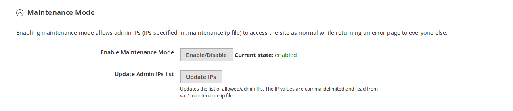

# Maintenance Mode guide

Available in version 1.2.91 of the plugin and higher

Enabling maintenance mode allows admin IPs (IPs specified in .maintenance.ip file) to access the site as normal while 
returning an error page to everyone else.

# Requirements

Before using this feature, make sure to Upload VCL to Fastly from the Fastly Configuration menu, or
by using the CLI command `bin/magento fastly:conf:set -u`. This will ensure that your Fastly service has the required 
snippets, dictionary and ACL containers.

# Toggle Maintenance Mode

To enable Maintenance Mode, use the Enable Maintenance Mode button in the Maintenance Mode tab of the Fastly 
Configuration, or use the CLI command `bin/magento fastly:maintenance -e`. Enabling Maintenance Mode will block all 
traffic from IP addresses not located in the `maint_allowlist` ACL container. The IP addresses should be updated by 
using the Update Admin IPs list option.

To disable Maintenance Mode, use the same button or the CLI command `bin/magento fastly:maintenance -d`.

# Update Admin IPs list

Before Maintenance Mode can be enabled, the list of allowed IP addresses in the `maint_allowlist` ACL container has to 
contain at least one IP address. To update the list, use the Update Admin IPs list button in the Maintenance
Mode tab of the Fastly Configuration or the CLI command `bin/magento fastly:maintenance -u`. This process will read 
all of the IP addresses contained in the `var/.maintenance.ip` file and add them to the `maint_allowlist` ACL container.

The `var/.maintenance.ip` file can be manually created or by using the Magento default CLI commands 
`bin/magento maintenance:enable [--ip=<ip address> ... --ip=<ip address>]` or 
`bin/magento maintenance:allow-ips <ip address> .. <ip address>`

