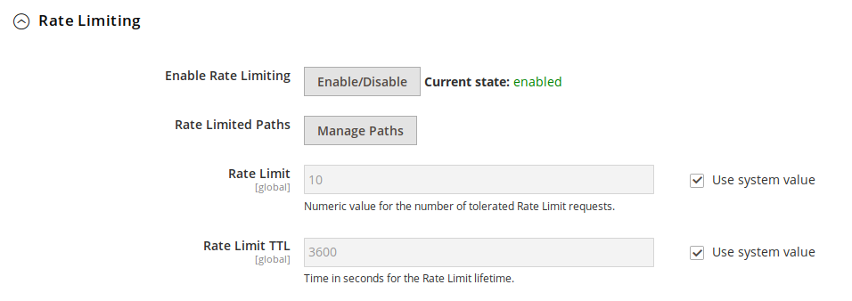

# Rate Limiting (limited)

*THIS FUNCTIONALITY IS EXPERIMENTAL. IT MAY BE REMOVED IN FUTURE RELEASES*

Rate Limiting is available from version 1.2.94 of the module. If you do not see it in your
module you will need to update your module.

This guide will show how to enable rate limiting. Rate limiting allows you to restrict how many requests a specific IP address
can make in a period of time e.g. 10 requests in one hour. It's intended to guard against abuse of sensitive or computationally
expensive endpoints e.g. /paypal/transparent/requestSecureToken etc. on your backend. It can also be used to guard against abusive crawlers.

Currently we support following rate limiting

- Path protection - protects certain sensitive or computationally expensive paths
- Abusive Crawler protection 

General limitations

- Only requests that hit your Magento origin/backend are counted

General principals

Rate limiting is applied by issuing a 429 Limit exceeded HTTP error code to the end user. Rate limit is applied if number of
requests by certain IP/client exceeds a threshold over a specified time window. In addition Fastly will tarpit all these 
requests for 5 seconds (this is adjustable by setting/adjusting `tarpit_interval` key in magentomodule_config edge dictionary).

## Path Protection

This feature is provided with following limitations:

1. You can only rate-limit specific paths. Paths are defined within the UI using regular expressions. 
2. Any paths defined as rate-limited *WILL NOT* be cached by Fastly. Therefore it's not a good idea to use to rate limit product, catalog 
   or other cacheable pages.
3. Rate limit applies to requests per IP address against the URL paths that have been specified. No other paths are rate limited

Once the block has been issued by the Magento backend Fastly will cache the blocking decision for the duration of the time window defined
in the Path Protection Rate Limit TTL.

To enable Path protection, go to:
```
Magento admin > Stores > Configuration > Advanced > System > Full Page Cache > Fastly Configuration
```
Under *Rate Limiting* tab, you can enable by clicking **Enable/Disable** button



After you have enabled the feature you will need to click on Manage Paths button.


In the manage paths window you will need to specify URL paths that will be rate limited as regular expression. 
For example to rate limit access to https://www.domain.com/paypal/transparent/requestSecureToken you would put

```
^/paypal/transparent/requestSecureToken
```

This will match any path starting with `/paypal/transparent/requestSecureToken` including

```
/paypal/transparent/requestSecureToken
/paypal/transparent/requestSecureToken/
/paypal/transparent/requestSecureToken/?something
```

You can test your regular expressions with [Regex Tester](https://regex101.com/).

Other useful examples

```
^(/index.php)?/rest/V1/
```

Block any URLs starting with `/index.php/rest/V1/` or `/rest/V1/`.


## Abusive Crawler Protection

Unlike path protection Abusive Crawler protection guards against a single user making excessive number of requests that hit your
Magento backend. By default we set the threshold to 100. After 100 requests in an hour we'll start returning a block to the user.

Following users are exempt from blocking

- IPs defined in var/maintenance.ip
- Known good Bots such as Googlebot or Bingbot. This can be changed by setting "Exempt Known Good Bots" to "No".
