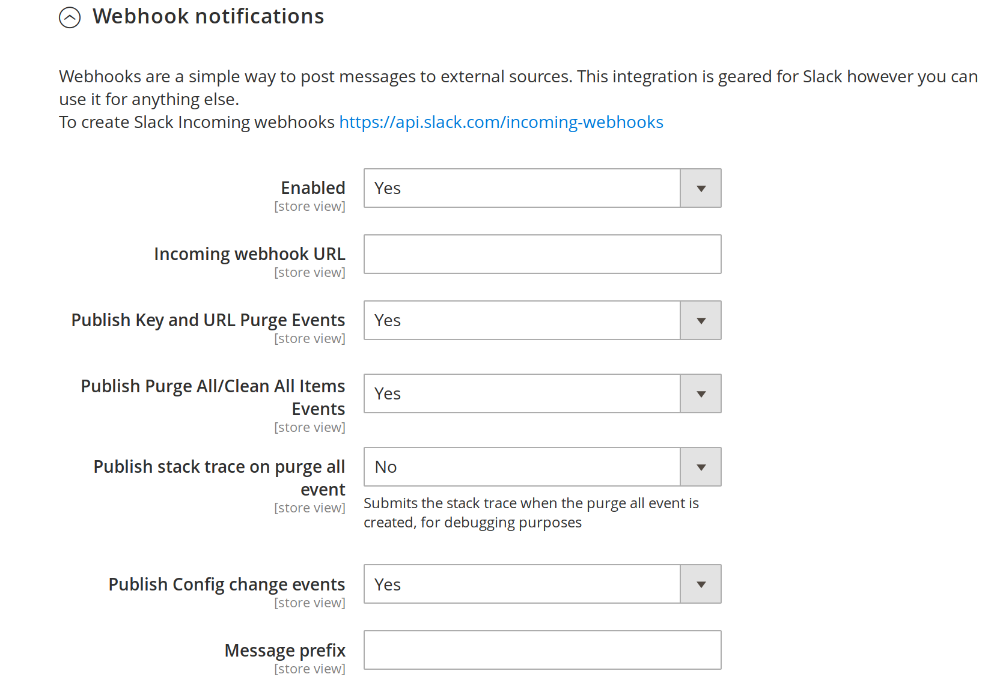
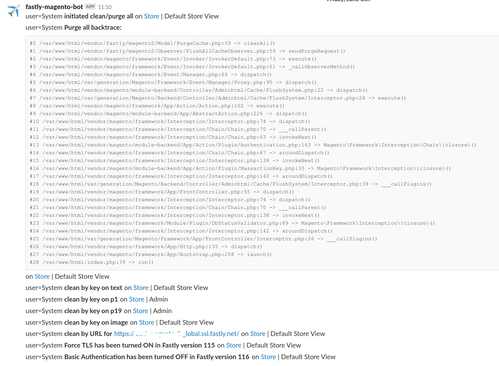

# Webhook Notifications

This guide will show you how to how to set up webhook notifications from the Fastly module. [Webhooks](https://en.wikipedia.org/wiki/Webhook)
are a way of surfacing activity from your Fastly plugin. Currently this integration is geared for Slack however you should be able to repurpose
it elsewhere.

## Prerequisites

* Webhook URL. To create a webhook URL follow [this guide from Slack](https://api.slack.com/incoming-webhooks).

### Fastly configuration

You can configure Webhook notifications in Fastly module by going to:

```
Magento admin > Stores > Configuration > Advanced > System > Full Page Cache > Fastly Configuration
```

Under the Fastly Configuration, click on the **Webhook notifications settings:**. After you enable it you will be presented with a menu
like this



At a minimum you will need to provide the webhook URL e.g.

https://hooks.slack.com/services/XXX/XXXX/XXXXX

By default Fastly module will send following notifications

* Publish Key and URL Purge Events	
* Publish Purge All/Clean All Items Events	
* Publish Config change events

Optionally you can

* Turn on showing stack trace of purge all events - this is useful if you are experiencing issues due to frequent purges and don't know
what may be triggering them
* Message prefix - useful if you are sending messages from multiple Magento instances

Once you have configured the webhook notifications you should see messages like this in your Slack channel


